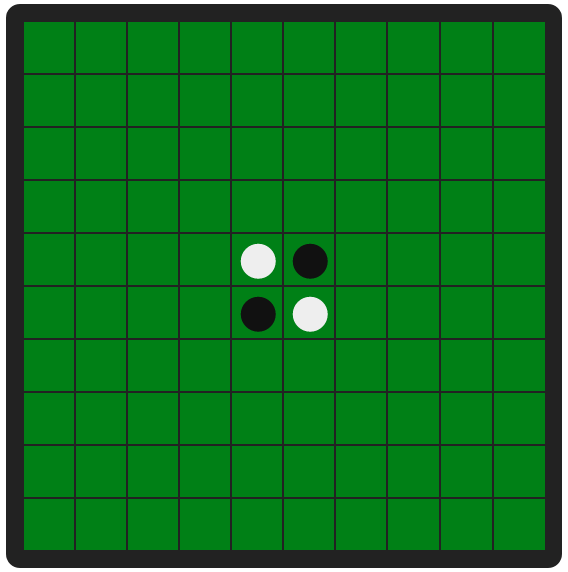
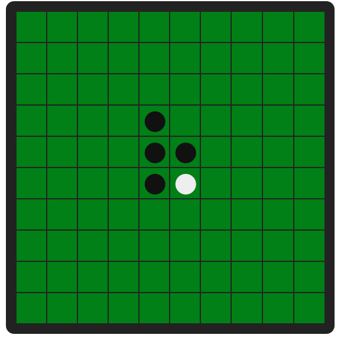

# BOTOMANIA 2020 - Reversi / Othello

# Clarification
- The first coordinate should be the row and the second one will be column
- The timelimit for each move is 1 second
- 1 represents black and 2 represents white in the grid

## Game Rules

Reversi is a classic board game for two players. Reversi is a very dynamic board game; the board position can change dramatically with each move. So make your bot think twice before every move!

Read the rules about the original game here:- https://learnplaywin.net/reversi-rules/

Make sure you have read the rules thoroughly before proceeding.

The game running on Botomania servers has some different rules than the original game :-
1. The grid is of the size 10 x 10 instead of 8 x 8.
2. There is no concept of passes. If you do not have a move, you lose.
3. If you make an invalid move, you lose. So it is your task to figure out which positions are valid.

## Input/Output instructions for C / C++ :-

Please add the following code snippet at the beginning of your main function before submitting. However, you can always comment it out for running the code on your terminal.

~~~
int main()
{
    freopen("input.in", "r", stdin);
    freopen("output.out", "w", stdout);
    /* YOUR LOGIC GOES HERE */
}
~~~

For every move you that you have to make, you are provided the current state of the board as input in the form of a 10x10 matrix. In the matrix, 0 means that the cell is empty, 1 means that the cell is occupied by the colour black and 2 means that the cell is occupied by the colour white. After the input of the matrix, an additional number is given to you which represents the whether you are playing black or white. (1 or 2 respectively.)

It is ensured that this number will remain the same throughout the game (but you have to take the input each time.)

Input example and the corresponding board representation :- 
~~~
0 0 0 0 0 0 0 0 0 0
0 0 0 0 0 0 0 0 0 0
0 0 0 0 0 0 0 0 0 0
0 0 0 0 0 0 0 0 0 0
0 0 0 0 2 1 0 0 0 0
0 0 0 0 1 2 0 0 0 0
0 0 0 0 0 0 0 0 0 0
0 0 0 0 0 0 0 0 0 0
0 0 0 0 0 0 0 0 0 0
0 0 0 0 0 0 0 0 0 0
1
~~~

For every input you have to give out two 0-indexed numbers (row, column), (on two seperate lines) telling where you want to place your piece.

Ouput example and the corresponding board representation:-

~~~
3
4
~~~

If you do not have a valid move then output:-

~~~
-1
-1
~~~

## Input / Output instructions for Python:-
Name your python program as `solution.py` and include a function called `make_move` which takes in two arguments, a `10x10 2D Matrix` and `Player-Number` and returns a `tuple` as the answer. Note that it is ensured that the player number will remain the same throughout the run of the game.

The matrix is of the form:-
~~~
0 0 0 0 0 0 0 0 0 0
0 0 0 0 0 0 0 0 0 0
0 0 0 0 0 0 0 0 0 0
0 0 0 0 0 0 0 0 0 0
0 0 0 0 2 1 0 0 0 0
0 0 0 0 1 2 0 0 0 0
0 0 0 0 0 0 0 0 0 0
0 0 0 0 0 0 0 0 0 0
0 0 0 0 0 0 0 0 0 0
0 0 0 0 0 0 0 0 0 0
~~~

Corresponding board image to the  above input:-

The `Player-Number` is either 1 or 2 depending on whether it is black or white respectively.

Note that it must be this function that must be called to take in input if you are using python.

To give the output, you must return a `tuple` (a common python data-structure) which contains the coordinates of your move. These coordinates must be 0 - indexed. In case you don't have any move left, the tuple must contain -1 as both the coordinates.

For example from the above situation of the board, a valid move for black (i.e. `Player-Number` =  1) is
~~~
(3, 4)
~~~
Corresponding board image:-

Sample Code in Python :-
~~~
def make_move(board_rep, player_num):
    #
    # YOUR LOGIC GOES HERE
    #
    return (coord1, coord2)
~~~